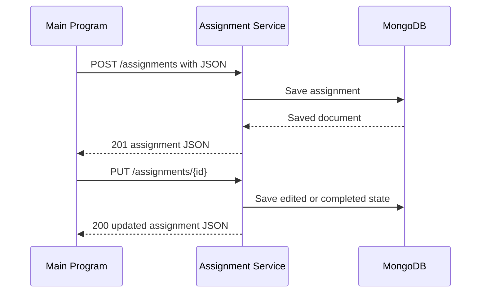

# Assignment Management Service

MS6 is a reusable service for creating and managing assignments or tasks from
different Main Programs. Elliott's Express and MongoDB implementation is the
main service in this repository.

## Communication contract

The service uses a REST API with JSON at `http://127.0.0.1:5003` by default.

| Method and path | Purpose |
| --- | --- |
| `GET /health` | Check whether the service is running |
| `POST /assignments` | Create an assignment or task |
| `GET /assignments/user/{userId}` | View assignments for one Main Program or user |
| `PUT /assignments/{id}` | Edit details or change completion state |
| `DELETE /assignments/{id}` | Remove an assignment |

Create requests require `userId`, `title`, and `dueDate`. Optional fields are
`description` and `completed`. Each Main Program chooses a stable `userId` for
its own assignments. For example, PrepTrack uses `PrepTrack`, while a Study
Planner or Habit Tracker can use its own program or user identifier without
changing the service.

### How to request data

Send JSON to `POST /assignments`:

```json
{
  "userId": "StudyPlanner",
  "title": "Review chapter notes",
  "description": "Prepare for the quiz",
  "dueDate": "2026-08-10",
  "completed": false
}
```

### How to receive data

Create requests return HTTP 201 with the saved assignment and its `_id`.

```json
{
  "_id": "service-created-id",
  "userId": "StudyPlanner",
  "title": "Review chapter notes",
  "description": "Prepare for the quiz",
  "dueDate": "2026-08-10T00:00:00.000Z",
  "completed": false
}
```

List requests return a JSON array. Updates return the updated assignment,
deletes return HTTP 204, and invalid or missing assignments return a JSON
`error` message.

## Request sequence



## Sprint 3 stories

- Create and view an assignment or task.
- Edit, complete, or delete an existing assignment or task.

## Setup

Install the project dependencies:

```powershell
npm install
```

## Running the service

For a demonstration without installing MongoDB, run:

```powershell
npm run demo-service
```

This starts a temporary MongoDB database and serves the API at
`http://127.0.0.1:5003`. It is meant for a quick demonstration and resets when
the service stops.

## Normal mode

The service can also connect to MongoDB through the `MONGODB_URI` environment
variable. Copy `.env.example` to `.env`, replace the placeholder URI, and run:

```powershell
npm start
```

Normal mode keeps assignments in the configured MongoDB database across page
refreshes, application restarts, and service reconnects.

## Testing

The tests use MongoMemoryServer, so a permanent database is not needed:

```powershell
npm test
```

The tests cover health, create, view, edit, complete, delete, validation during
updates, and persistence after a database reconnect.

## Live test program

Keep either normal mode or `npm run demo-service` running. In another terminal:

```powershell
npm run demo-test
```

The test program prints the JSON create, list, and update responses, then
deletes its demonstration assignment. Set `ASSIGNMENT_SERVICE_URL` when the
service uses a different local URL.

## Remaining shared work

The planned create, view, edit, complete, delete, persistence, and reusable
cross-program contract are implemented. Filtering, pagination, bulk updates,
and duplicate rules remain optional shared follow-up work.
